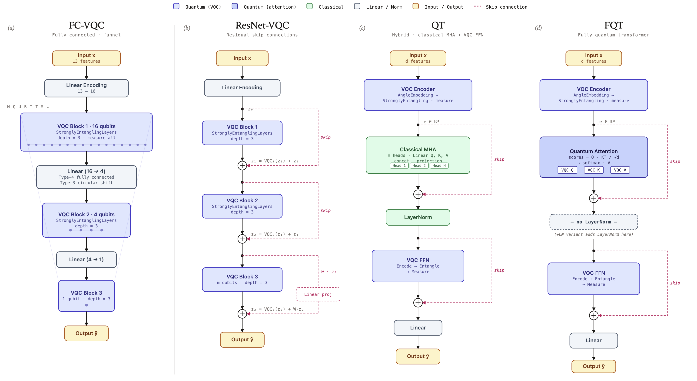

# Do Quantum Transformers Help? A Systematic VQC Architecture Comparison on Tabular Benchmarks

Quantum machine learning research code for a **systematic empirical comparison**
of four variational quantum circuit (VQC) architectures on tabular regression
and classification benchmarks.

**Paper:** *Do Quantum Transformers Help? A Systematic VQC Architecture
Comparison on Tabular Benchmarks* — submitted to IEEE QCE 2026 (QML Track).



## Key Findings

1. **FC-VQCs are the most parameter-efficient** quantum architecture, achieving
   90–96% of the R² of attention-based VQCs with 40–50% fewer parameters, and
   consistently outperforming equal-capacity MLPs (mean R²=0.829 vs MLP₇₂₀'s
   0.753 on Boston Housing).
2. **Quantum attention adds marginal benefit** on small tabular data — FC-VQC's
   Type-4 connectivity already provides partial cross-token mixing analogous to
   uniform attention.
3. **Expressibility saturates at depth ≈ 3** — deeper circuits add parameters
   without accessing new regions of Hilbert space.
4. **FQT is more noise-robust than QT** — 3-seed matched depolarizing-noise
   study (Boston, p_d∈{0,.001,.01}) shows FQT remains stable while QT collapses
   at higher noise; the apparent mild regularization is within seed variance.
5. **No barren plateau** across the four architectures (3-qubit / depth-3
   regime); FC-VQC has the largest median gradient signal (~7× that of QT),
   consistent with its faster convergence.
6. All quantum-model results validated across **3 random seeds** with mean ± std.

## Architectures

| Architecture | Description | Params (Boston) |
|-------------|-------------|---------------:|
| **FC-VQC** | Cascaded VQC blocks with Type-4 fully-connected inter-block mixing | 720 |
| **ResNet-VQC** | FC-VQC + classical residual (skip) connections | 720 |
| **QT (Route A)** | Classical self-attention on VQC-encoded features + VQC FFN | 1,380 |
| **FQT (Route B)** | Fully quantum attention via transpose-and-entangle + VQC FFN | 855 |

All models use the `StronglyEntanglingLayers` ansatz from PennyLane as the base
quantum circuit block, with 3-qubit tokenization.

Implementations: [shared_models.py](shared_models.py) (ResNet-VQC, QT, FQT),
per-experiment `models.py` (FC-VQC variants),
[classical_models.py](classical_models.py) (MLP, XGBoost, CatBoost, etc.).

## Datasets

| Dataset | Task | n | Features |
|---------|------|--:|--------:|
| Boston Housing | regression | 506 | 13 |
| CA Housing | regression | 20,640 | 8 |
| Concrete | regression | 1,030 | 8 |
| Wine Quality (Red) | classification | 1,599 | 11 |
| Wine Quality (Red+White) | classification | 6,497 | 12 |
| MNIST 4 vs 9 | binary classification | 4,000 (subset) | 11 (PCA-reduced) |

## Results (3-seed mean ± std)

### Regression (Test R²)

| Model | Boston | CA Housing | Concrete | #params |
|-------|--------|-----------|----------|--------:|
| CatBoost | **.862±.008** | **.854±.005** | **.931±.018** | ~35K |
| XGBoost | .845±.013 | .850±.002 | .914±.016 | ~95K |
| MLP₇₂₀ | .753±.039 | .800±.009 | .867±.018 | 721 |
| **FC-VQC** | .829±.042 | .750±.001 | .774±.021 | 486–720 |
| ResNet-VQC | .775±.040 | .783±.004 | .819±.028 | 486–720 |
| QT | .742±.071 | .807±.001 | .853±.011 | 828–1,380 |
| FQT | .705±.078 | .794±.007 | .780±.016 | 513–855 |

FC-VQC uses **48× fewer parameters** than CatBoost while achieving 96% of its
R² on Boston Housing.

## Usage

### Config-driven training

```bash
# Compare models on a dataset
python train.py --config configs/boston_compare.json

# Run with a specific seed
python train.py --config configs/boston_multiseed.json --seed 42

# Multi-seed batch (4 key models × 5 datasets × 3 seeds)
bash run_multiseed.sh

# Classical baselines multi-seed
bash run_classical_multiseed.sh

# Aggregate results into mean±std tables + training curve plots
python aggregate_multiseed.py
```

### Other experiments

```bash
# Architecture ablation (attention removal, FFN modes, LayerNorm)
python train.py --config configs/boston_ablation.json --seed 42

# Multi-seed ablation across all 5 datasets
bash run_ablation_multiseed.sh

# Noise robustness — 3-seed matched (FQT, Boston Housing)
bash run_noise_multiseed.sh

# MNIST 4 vs 9 binary classification (3-seed)
bash run_mnist_multiseed.sh

# Expressibility analysis
python expressibility_analysis.py --n_samples 10000

# Barren-plateau / gradient-variance plot
python plot_barren_plateau.py

# Summarize all results into LaTeX tables
python summarize_results.py
```

### Configs

Configs live in [configs/](configs/) organized as `<dataset>_<kind>.json`:
- `compare` — main model comparison
- `multiseed` — 4 key quantum models for multi-seed validation
- `ablation` — attention/FFN/LayerNorm ablations
- `noise` — depolarizing noise robustness
- `classical` / `boosting` — classical baselines
- `mlp720` — equal-capacity MLP baseline
- `transformers_mh` — multi-head attention scaling

## Paper

The QCE 2026 submission lives in [QCE26_Q_FC_Transformer/](QCE26_Q_FC_Transformer/):

```
QCE26_Q_FC_Transformer/
├── main.tex              # Full paper (IEEE conference format)
├── ref.bib               # References
├── macros.tex            # LaTeX macros
├── IEEEtran.cls          # IEEE template
└── figures/
    ├── architectures_4panel.png    # Architecture diagram
    ├── pareto_r2_vs_params.png     # Parameter efficiency plot
    ├── boston_training_curves.png  # Training curves
    ├── expressibility_results.png  # Expressibility analysis
    └── grad_variance.png           # Trainability / gradient-variance plot
```

## Project Layout

```
.
├── train.py                    # Config-driven training entry point
├── shared_models.py            # ResNet-VQC, QT, FQT implementations
├── classical_models.py         # Classical baselines
├── aggregate_multiseed.py      # Multi-seed result aggregation
├── expressibility_analysis.py  # VQC expressibility measurement
├── summarize_results.py        # Cross-run metric aggregation
├── configs/                    # Experiment JSON configs
├── BostonHousing/              # Dataset-specific models
├── CA_Housing/
├── Concrete/
├── WineQuality_Red/
├── WineQuality_RedandWhite/
├── MNIST_4v9/                  # MNIST binary subset + PCA prep script
├── plot_barren_plateau.py      # Gradient-variance / trainability plot
├── run_multiseed.sh            # Multi-seed quantum models (main 4)
├── run_classical_multiseed.sh  # Multi-seed classical baselines
├── run_noise_multiseed.sh      # 3-seed matched noise study (FQT)
├── run_ablation_multiseed.sh   # 3-seed ablation across datasets
├── run_mnist_multiseed.sh      # MNIST 4 vs 9 multi-seed
└── QCE26_Q_FC_Transformer/     # Paper (IEEE QCE 2026)
```

## Requirements

- Python 3.11+
- PyTorch
- PennyLane (quantum circuit simulation)
- scikit-learn, pandas, matplotlib
- xgboost, catboost (for classical baselines)

## Citation

If you find this work useful, please cite:

```bibtex
@inproceedings{chen2026quantum_transformers_help,
  title={Do Quantum Transformers Help? A Systematic {VQC} Architecture Comparison on Tabular Benchmarks},
  author={Chen, Chi-Sheng and Su, Howard},
  booktitle={IEEE International Conference on Quantum Computing and Engineering (QCE)},
  year={2026}
}
```
